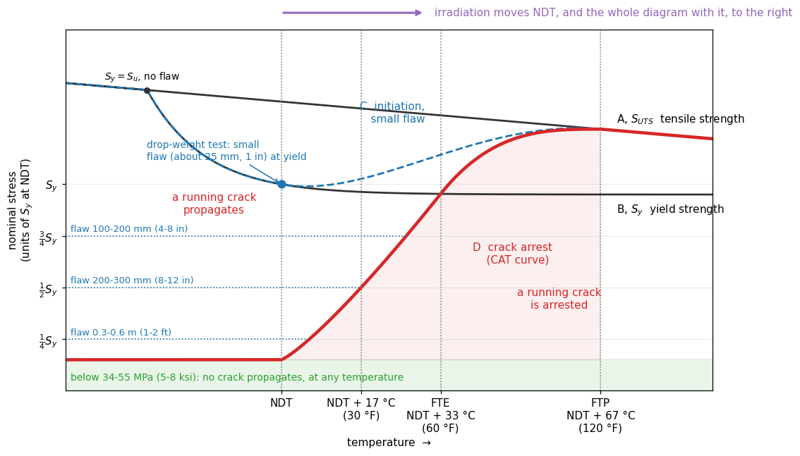

# Exercise: brittle fracture and the Fracture Analysis Diagram

A ferritic steel for a pressure vessel. Its Fracture Analysis Diagram is below, with all
temperatures counted from the nil-ductility temperature NDT measured in the drop-weight
test.



| data | value |
|---|---|
| yield strength | $S_y = 300$ MPa |
| tensile strength | $S_u = 480$ MPa |
| lower fracture propagation stress | 34-55 MPa (5-8 ksi) |
| crack-arrest curve at $\frac12 S_y$ | NDT + 17 °C (30 °F) |
| FTE, crack-arrest curve at $S_y$ | NDT + 33 °C (60 °F) |
| FTP, crack-arrest curve at $S_u$ | NDT + 67 °C (120 °F) |

Temperature differences in °F convert with the factor 5/9 alone; absolute temperatures with
$(T_F - 32)\cdot 5/9$.

## Questions

1. A crack is already running through the steel. Does it keep running or is it arrested in each case?
   (a) NDT - 10 °C, 30 MPa; (b) NDT - 10 °C, 150 MPa; (c) NDT + 45 °C, 250 MPa;
   (d) NDT + 20 °C, 300 MPa; (e) NDT + 60 °C, 400 MPa.
2. The stress that matters is the total one, applied **plus residual**. A welded vessel is
   loaded to a membrane stress of 100 MPa, a third of $S_y$. Why does it still have to be
   pressurised above FTE?
3. A vessel is brought to pressure at no less than 4 °C (40 °F), and its total stress
   reaches $S_y$. What is the highest NDT the steel may have? What is the most stress the
   vessel may carry below that NDT?
4. The steel is bought with NDT = -30 °C (-22 °F). After years of service, surveillance
   specimens show an NDT shift of 50 °C (90 °F).
   (a) Where are NDT, FTE and FTP now?
   (b) May the vessel still be brought to full pressure at 4 °C?
   (c) What is the lowest temperature at which it may?
5. Why does irradiation move NDT to the right? Answer with the Davidenkov construction:
   the yield stress against the cleavage fracture stress.
6. *(Jawad and Farr, 2019, Example 4.2.)* A low-carbon steel with NDT = 15 °F (-9 °C) is used
   in a pressure vessel. What is the minimum safe operating temperature? What if stress
   concentrations take the stress beyond yield in some areas?
7. *(Jawad and Farr, 2019, Example 4.3.)* A low-carbon steel vessel with NDT = -20 °F
   (-29 °C) is to start up at 0 °F (-18 °C), at a stress of half the yield strength. Is the
   start-up temperature safe?

---

## Solution

### 1. Reading the diagram

The crack-arrest curve D runs along the lower fracture propagation stress, 34-55 MPa, up to
NDT, then rises through $\frac12 S_y = 150$ MPa at NDT + 17 °C, $S_y = 300$ MPa at
FTE = NDT + 33 °C and $S_u = 480$ MPa at FTP = NDT + 67 °C.

| case | where | regime | verdict |
|:---|:---|:---:|:---|
| (a) NDT - 10 °C, 30 MPa | under the lower fracture propagation stress | I | **arrested**: below 34 MPa no crack runs, at any temperature |
| (b) NDT - 10 °C, 150 MPa | above it, left of curve D | II | **propagates**: a small flaw would not start a crack here, but one already running keeps going |
| (c) NDT + 45 °C, 250 MPa | right of FTE, below $S_y$ | IV | **arrested**: past FTE no crack runs under elastic stress |
| (d) NDT + 20 °C, 300 MPa | at yield, left of FTE | II | **propagates**: FTE is NDT + 33 °C |
| (e) NDT + 60 °C, 400 MPa | right of FTP, above yield | IV | no brittle fracture: past FTP failure is by shear |

The regimes are those of the shaded diagram: I below the lower fracture propagation stress,
II above the crack-arrest curve D but below the initiation curve of a small flaw, III above
both, IV to the right of D. Cases (b) and (d) are regime II, where nothing starts from a
small flaw, but the question supposes a crack already running, and above D it runs.

Cases (c) and (d) carry nearly the same stress and differ only in temperature. That is the
point of the diagram: whether a stress is safe depends on how far above NDT the steel is.

### 2. Residual stress

A weld leaves residual stresses that stress relief does not remove entirely. The amount
left can conservatively be taken as of the order of the yield strength (Harvey, 1974,
§5.22). The total, applied plus residual, then reaches $S_y$ even though the applied load is
only a third of it. A crack can run at $S_y$ anywhere left of FTE, so the vessel has to be above FTE before
it is pressurised.

### 3. Choosing a steel

At $S_y$ the vessel has to be at or above FTE when it is pressurised:

```math
\text{NDT} + 33\ ^\circ\text{C} \le 4\ ^\circ\text{C}
\quad\Rightarrow\quad
\text{NDT} \le -29\ ^\circ\text{C}\ (-20\ ^\circ\text{F})
```

In °F the data are round: 40 - 60 = -20 °F = -28.9 °C.

Below NDT the total stress must stay under the lower fracture propagation stress, **34-55 MPa
(5-8 ksi)**: Chattopadhyay (2005) takes the low end, 34.5 MPa. On a cold vessel that is a small fraction of the operating stress
(Weisman, 1977, §10.4).

### 4. A vessel ages

(a) Every temperature on the diagram is counted from NDT, so the whole diagram moves by the
shift:

| | as bought | after the shift |
|:---|:---:|:---:|
| NDT | -30 °C (-22 °F) | **20 °C (68 °F)** |
| FTE = NDT + 33 °C | 3 °C (38 °F) | **53 °C (128 °F)** |
| FTP = NDT + 67 °C | 37 °C (98 °F) | **87 °C (188 °F)** |

(b) **No.** At 4 °C the steel is now 16 °C *below* its NDT: only the lower fracture
propagation stress, 34-55 MPa, is allowed. When new, 4 °C was just above FTE and the
vessel could be loaded to yield.

(c) Full pressure needs $T \ge$ FTE: **53 °C (128 °F)**. The vessel has to be heated before it
is pressurised, and the minimum pressurisation temperature has risen by the whole shift,
50 °C.

### 5. Why irradiation moves NDT

Neutrons fill the lattice with defects that obstruct dislocations. The yield stress rises
at every temperature, while the cleavage fracture stress hardly changes. The temperature
where the two cross, below which the steel cleaves before it can yield, moves up. So does
NDT, and with it the whole diagram.

### 6. Minimum safe operating temperature (Jawad and Farr, Example 4.2)

No stress level is given, so the stress is assumed at yield. At $S_y$ the crack-arrest
curve is crossed at FTE:

```math
T_{\min} = \text{NDT} + 60\ ^\circ\text{F} = 15 + 60 = 75\ ^\circ\text{F}\ (24\ ^\circ\text{C})
```

If stress concentrations take the stress beyond yield in some areas, the conservative
choice is FTP:

```math
T_{\min} = \text{NDT} + 120\ ^\circ\text{F} = 135\ ^\circ\text{F}\ (57\ ^\circ\text{C})
```

In °C: NDT = -9.4 °C, plus 33.3 °C and 66.7 °C, gives 23.9 °C and 57.2 °C.

### 7. A cold start-up (Jawad and Farr, Example 4.3)

At half the yield strength the crack-arrest curve gives NDT + 30 °F:

```math
T_{\min} = -20 + 30 = 10\ ^\circ\text{F}\ (-12\ ^\circ\text{C})
```

The start-up at 0 °F (-18 °C) is below it, so it is **unsafe**. Either the stress is reduced
during start-up, or a steel with a lower NDT is chosen.

**A limit of the diagram that matters for a reactor vessel.** Jawad and Farr (p. 39) give two
conditions for using these steps: the steel has to be a low-carbon steel, and the section
less than 2 in (51 mm) thick. Above 6 in (152 mm) it has been proposed to take
FTE = NDT + 120 °F (67 °C) instead of NDT + 60 °F, and FTP = NDT + 210 °F (117 °C) instead
of NDT + 120 °F. A reactor vessel wall is well over 6 in thick, so for it the diagram as
drawn is on the unconservative side.
